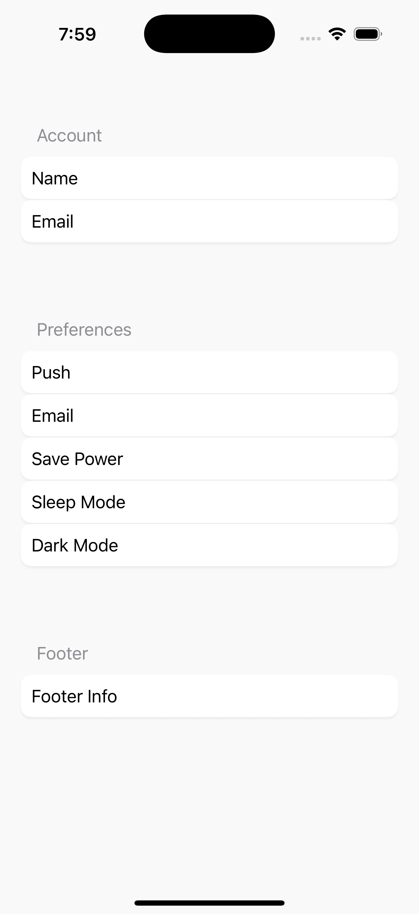

# 04 – Hierarchical and Declarative Layout Architecture with `StackBoard`



## Introduction

`StackBoard` is a SwiftUI layout system inspired by Apple’s native `Form` and `Section` components. It provides a similar declarative interface for grouping related UI elements in a structured, vertically stacked format. This makes it well-suited for settings screens, preference panels, or any UI where logical sectioning improves clarity.

The goal of `StackBoard` is to mirror the design principles of `Form` while introducing additional architectural clarity. It preserves semantic roles at runtime, making it possible to inspect, traverse, and transform view hierarchies dynamically. While Apple’s native implementation abstracts away structural details for simplicity, `StackBoard` makes them accessible by exposing just enough internals to support recursive layout logic, flattening, and compositional inspection.

Though inspired by Apple’s system, this framework is not an attempt to replace it. Rather, it serves as a learning exercise and an architectural foundation for building extensible layout primitives. `StackBoard` remains lightweight, idiomatic, and fully aligned with SwiftUI’s declarative approach—it simply adds tools to think more deeply about structure and composition.

## Core Design Features

- **Semantic Role Recognition**: Differentiates between atomic views (`StackBoardSection`'s nested views) and structural containers (`StackBoardSection` itself) using marker protocols (`StackBoardSectionSource`).
- **Recursive Layout Flattening**: Flattens nested section structures into unified visual outputs using `filter(blocks:)`.
- **Metadata-Preserving Type Erasure**: Leverages custom wrappers to retain behavioral metadata via `AnyBlock` type-erasure.
- **Declarative Syntax via DSL**: Provides a fluent interface using `@resultBuilder` on `StackBoardBuilder` struct for seamless composition.

`StackBoard` serves as a compositional foundation for architecting type-responsive and declarative layout frameworks in SwiftUI.

---

## The Limitation of Swift's Generic Inference for Type Recognition

SwiftUI’s opaque return types (`some View`) are powerful for abstraction, but they come at a cost: loss of concrete type identity. In other words, opaque return types are compiler-managed types, and Swift is purposefully abstracting them from us for type-safety reasons. 

Now, in the context of `StackBoard`, this is a significant hindrance when detecting the role of a child view: I needed a mechanism to identify whether a view is a `StackBoardSection` and, if so, recursively extract and traverse its contents. That way, I was able to filter out any child view that's a `StackBoardSection` and be left with any other view. 

The behavior I just described above resembles the native `Form` component's mechanism, which doesn't allow us to lay out contents in a `Section` view that's nested — however many levels deep (hence the need for recursing) — in a first-level `Section` (main section). In such a case, those child views nested within that deeper `Section` view are going to be recursively collected and displayed — in the order of their appearance (depth-first traversal) — into the main `Section` view.

Now, if you were to rely solely on type casting, that wouldn't be a very flexible option, especially if the `StackBoardSection` struct is using generics:

```swift
public struct StackBoardSection<Header: View, Footer: View>: View {
```

For example, look at the following code snippet, which is trying to use optional downcast — using the `as?` operator — with a concrete type `StackBoardSection<Text, EmptyView>`:

```swift
if let section = view as? StackBoardSection<Text, EmptyView> {
    // This will fail unless it's exactly that instantiation
}
```

This becomes problematic due to Swift's use of generics. `StackBoardSection` is a generic type parameterized over `Header` and `Footer`, so each instantiation — e.g., `StackBoardSection<Text, EmptyView>` vs. `StackBoardSection<Text, Text>` — is treated as a unique type by the compiler. As a result, runtime type checking, or downcasting, is quite fragile, and while recursively traversing our tree of type-erased views (`AnyBlock`), we will likely miss some `StackBoardSection` view, in case we defined our `header` and `footer` properties differently upon instantiating the `StackBoardSection` struct.

Therefore, that rigid behavior undermines our goal of supporting deeply nested sections with flexible headers and footers, and that's the reason why I came up with protocol-oriented programming, using a marker protocol.

### Solution: Marker Protocol and Interface Abstraction

To overcome this, `StackBoard` introduces a **marker protocol**, `StackBoardSectionSource`, that all `StackBoardSection` types conform to, regardless of their generic parameters. Through this abstraction, the framework can:

- Dynamically recognize whether a view acts as a section
- Recursively extract the section’s children
- Preserve runtime behavior without depending on exact generic instantiations

```swift
protocol StackBoardSectionSource: View {
    func extractBlocks() -> [AnyBlock]?
}
```

This design reflects Swift’s protocol-oriented programming philosophy. Rather than relying on fragile downcasting or generic specialization, we decouple behavior from type identity and reintroduce flexible, runtime-safe introspection.

> **Summary:** This design unlocks recursive traversal, compositional transparency, and semantic expressiveness in a type-safe and extensible manner.

---

## AnyBlock: Wrapping Views with Semantics

To further facilitate this flexibility, we introduce `AnyBlock`: a type-erased wrapper around any `View`. Unlike `AnyView`, which erases type without context, `AnyBlock` preserves semantic metadata:

```swift
public struct AnyBlock: Identifiable, View {
    public let id: UUID = UUID()
    fileprivate let isSection: Bool
    fileprivate let source: (any StackBoardSectionSource)?
    private let view: AnyView

    public init<T: View>(_ wrapped: T) {
        if let source = wrapped as? any StackBoardSectionSource {
            self.source = source
            self.isSection = true
        } else {
            self.source = nil
            self.isSection = false
        }
        self.view = AnyView(wrapped)
    }

    public var body: some View {
        view
    }
}
```

This wrapper is critical for differentiating between leaf views and structural containers (i.e., sections), enabling runtime behavior branching.

---

## DSL with `@resultBuilder`

To maintain SwiftUI’s expressive declarative syntax, we define a domain-specific language using `@resultBuilder`. This DSL automatically wraps each view in an `AnyBlock`, producing a uniform, inspectable data structure:

```swift
@resultBuilder
public struct StackBoardBuilder {
    public static func buildBlock(_ components: AnyBlock...) -> [AnyBlock] {
        components
    }

    @MainActor
    public static func buildExpression<T: View>(_ expression: T) -> AnyBlock {
        return AnyBlock(expression)
    }
}
```

This guarantees compatibility with heterogeneous views while maintaining structural semantics.

---

## StackBoardSection: Compositional Grouping

`StackBoardSection` acts as a logical grouping mechanism with optional headers and footers. It conforms to `StackBoardSectionSource` and exposes its children through `extractBlocks()`:

```swift
extension StackBoardSection: StackBoardSectionSource {
    func extractBlocks() -> [AnyBlock]? {
        self.blocks
    }
}
```

```swift
public struct StackBoardSection<Header: View, Footer: View>: View {
    public let blocks: [AnyBlock]
    public let header: Header
    public let footer: Footer

    public init(
        @StackBoardBuilder content: () -> [AnyBlock],
        @ViewBuilder header: () -> Header,
        @ViewBuilder footer: () -> Footer
    ) {
        self.blocks = content()
        self.header = header()
        self.footer = footer()
    }

    public var body: some View {
        VStack {
            HStack {
                header
                    .padding(.leading, 15)
                    .padding(.top, 2)
                    .foregroundStyle(.gray)
                Spacer()
            }

            StackBoardSectionContent(blocks: blocks)
            footer
        }
        .frame(maxWidth: .infinity)
        .padding(.horizontal, 20)
        .padding(.vertical, 35)
    }
}
```

---

## Recursive Tree Traversal

To support arbitrarily nested sections, `StackBoardSectionContent` recursively flattens its input. The engine performs a depth-first traversal of `AnyBlock` wrappers:

```swift
private func filter(blocks: [AnyBlock]) -> [AnyBlock] {
    var flat = [AnyBlock]()
    for block in blocks {
        if let nested = block.source?.extractBlocks() {
            flat.append(contentsOf: filter(blocks: nested))
        } else {
            flat.append(block)
        }
    }
    return flat
}
```

This flattening ensures visual consistency and avoids unintended nesting artifacts.

---

## StackBoard: Rendering Logic

The main layout engine uses metadata in `AnyBlock` to decide rendering strategy at runtime:

```swift
public struct StackBoard: View {
    let blocks: [AnyBlock]

    public init(@StackBoardBuilder content: () -> [AnyBlock]) {
        self.blocks = content()
    }

    public var body: some View {
        VStack {
            VStack(spacing: 1) {
                ForEach(blocks) { block in
                    if block.isSection {
                        block
                    } else {
                        VStack {
                            block.padding(10)
                        }
                        .frame(maxWidth: .infinity, alignment: .leading)
                        .background(
                            RoundedRectangle(cornerRadius: 10)
                                .fill(.white)
                                .shadow(color: .black.opacity(0.05), radius: 1, x: 0, y: 2)
                        )
                        .padding(.horizontal, 20)
                    }
                }
            }
            .padding(.top, 20)
            Spacer()
        }
        .frame(maxWidth: .infinity, maxHeight: .infinity)
        .background(Color.gray.opacity(0.05))
    }
}
```

### Example

```swift
StackBoard {
            
    // Section behavior parsed
    StackBoardSection("Account") {
        Text("Name")
        Text("Email")
    }
    
    // Section behavior parsed
    StackBoardSection("Preferences") {
        
        // Section behavior ignored
        StackBoardSection("Notifications (Ignored)") {
            Text("Push")
            Text("Email")
            
            // Section behavior ignored
            StackBoardSection("Modes (Ignored)") {
                Text("Save Power")
                Text("Sleep Mode")
            }
        }
        
        Text("Dark Mode")
    }
    
    // Section behavior parsed
    StackBoardSection("Footer") {
        Text("Footer Info")
    }
}
```

This produces a flat, semantically structured layout regardless of nested depth.

---

## Summary: Principles and Takeaways

- **Reflective Composition**: Enables runtime hierarchy evaluation
- **Protocol-Driven Design**: Avoids fragile generic specializations
- **Structural Flattening**: Supports deeply nested yet visually linear layouts
- **Declarative Ergonomics**: Maintains intuitive authoring syntax

---

